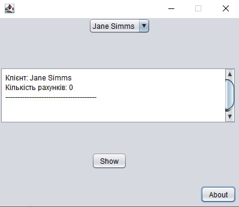

# UI Lab 4

# Практична робота: Проектування та розробка графічного інтерфейсу (GUI) за допомогою конструктора Matisse

**Мета роботи:** Навчитися проектувати графічні інтерфейси користувача за допомогою візуального конструктора Matisse в середовищі NetBeans, налаштувати автоматичне масштабування та обмеження розмірів вікна, реалізувати зчитування структурованих даних із файлу `test.dat` за допомогою класу `DataSource` та налаштувати інтерактивну взаємодію елементів керування з доменною моделлю банку.

1. У середовищі розробки NetBeans створено новий проєкт із назвою `MatisseDemo` без генерації стандартного головного класу.
2. До шляху компіляції проєкту (`Classpath`) успішно підключено зовнішню бібліотеку `MyBank.jar` із попередніх робіт.
3. За допомогою інструменту Matisse створено візуальну форму `BankFrame.java`, яка містить випадаючий список `jComboBox1`, текстову область `textAreaOutput` та кнопки `buttonShow` і `buttonAbout`. Для форми активовано заборону на зміну розмірів (`setResizable(false)`).
4. Реалізовано автоматичне завантаження бази даних клієнтів із зовнішнього файлу `test.dat` через об'єкт класу `DataSource` при старті додатка.
5. Написано обробники подій для кнопок:
   * Натискання на `Show` динамічно отримує обраного клієнта через статичний метод `Bank.getCustomer()` та виводить детальну інформацію про всі його рахунки й баланси у текстове поле.
   * Натискання на `About` викликає модальне діалогове вікно `JOptionPane` з інформацією про розробника та програму.

## Демонстрація роботи програми

